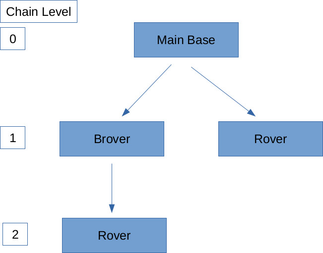

# UBLOX_read

A library for parsing UBLOX packets and interfacing with UBLOX gps receivers. It has been designed for use with the M8N and F9P GNSS receivers.

This library provides rather basic functionality and is designed to work under a linux environment, however it should probably work in Windows or Mac as it uses the cross-platform [`async_comm`](https://github.com/dpkoch/async_comm) library as the serial interface.

The UBX parsing functionality is abstracted into a library for easy integration in other projects.  Example usage is given in the `main.cpp` file.

# TL;DR 

## Option 1: One GNSS Module
`roslaunch ublox standard.launch`

`rostopic echo /base/PosVelTime`: Listen to GNSS Data

## Option 2: One Base, One Rover

`roslaunch ublox OneComp.launch` (You need to modify IP addresses of your computers in this file if you are using two computers!)

`rostopic echo /rover/RelPos`: Access RelPos data

# Documentation

## Basic Configurations

All configurations are specified in [launch files](#launch-files).

**Stationary Base** assumes no movement and can thus provide a very stable global position, which translates to high-quality RTK corrections sent to the **Rover**, which can output around 10 Hz.

**Moving Base** is like a stationary base, but does not assume position is fixed. This generally results in heavier RTK computational solutions for the **Rover**, which decreases the rate of positional messages from the **Rover** to 5 Hz.

**Brover** is a moving base which receives RTK corrections from a different base. While this approach helps increase the accuracy of the moving base, it places much more computational strain on the **Brover**, causing it to subsequently send less messages to its **Rovers**. See [Chaining](#chaining) for more information.

**Rover** always has a **Base** that it listens to in order to receive RTK corrections. These corrections allow the **Rover** to compute its relative position to a **Base** with an extremely high degree of accuracy (standard deviations are around .025 m horizontally, and .1 m vertially)

## Launch Files

A single node corresponds to a single module. All nodes must specify
1. `serial_port`: Serial port to connect to the module from the the computer. Defaults to `/dev/ttyACM0`
2. `chain_level`: The distance of the module from the main base of the module tree. See [Chaining](#chaining) for more information. 
3. `rover_quantity`: The number of rovers the computer must send GNSS data from the module to.
4. `local_host`: The name of the computer on the network. Usually just `localhost`
5. `local_port`: A port number over which UDP communication will occur. See [Communication Protocols](#communication-protocols)

Other possible parameters include
1. `rover_host`: The IP address of the **Rover** computer.
2. `rover_port`: The port number over which UDP communication will be received by the **Rover** computer.
3. `base_host`: The IP address of the **Base** computer from which the local computer recevies [RTCM](#rtcm) correctional data.
4. `base_port`: The port number of the **Base** computer from which the [RTCM](#rtcm) data was sent.

## Chaining



## Communication Protocols

The UBLOX GNSS module uses three distinct communication protocols

1. [NMEA](#nmea)
2. [UBX](#ubx)
3. [RTCM](#rtcm)

### NMEA

This protocol is not currently in use.

### UBX

The computer configures settings on the UBLOX GNSS module via UBX protocol.

The module sends messages containing GNSS data back to the computer via UBX protocol.

These communications happen over a serial port.

### RTCM

The UBLOX GNSS **Base** sends its GNSS data to the computer in RTCM format. The **Base** computer then sends this data to the **Rover** computer, which is then forwarded to the **Rover** module via the serial port. 

The **Rover** module then uses this information to calculate RTK corrections and achieve accurate relative position information. The relative position data is sent back to the **Rover** computer via the serial connections

## ROS Messages
 * **PosVelTime:** GNSS Positional/Velocity Data given in lla with an accurate timestamp
 * **PosVelEcef** GNSS Positional Data given in ECEF frame. (Velocity is copied from PosVelTime message)
 * **RelPos:** RTK Corrected Relative Position of the module relative to its base (only output on rover)
 * **SurveyStatus:** Information about Survey-in Parameters including current mean position accuracy (only for a stationary base)

## ROS Services
 * **CfgValGet:** Access configuration settings on the module via UBX protocol. The module returns 
    1. Acknowledgement response
    2. Configuration ID and corresponding value
 * **CfgValDel:** Delete configuration settings. The module returns an acknowledgement response
 * **CfgValSet:** Set configuration settings. The module returns an acknowledgement response

## Building

``` bash
mkdir build
cd build
cmake ..
make -j
```
## Submodule
In UBLOX_Read use the command
`git submodule update --init --recursive`
in order to activate the [`async_comm`](https://github.com/dpkoch/async_comm) library.

## Running the example
``` bash
./ublox
```

## UBLOX Documentation
 * [Interface Description](https://www.u-blox.com/sites/default/files/u-blox_ZED-F9P_InterfaceDescription_%28UBX-18010854%29.pdf) contains information about various messages from the module.
 * [UBLOX F9P Site](https://www.u-blox.com/en/product/zed-f9p-module) contains more useful documents

